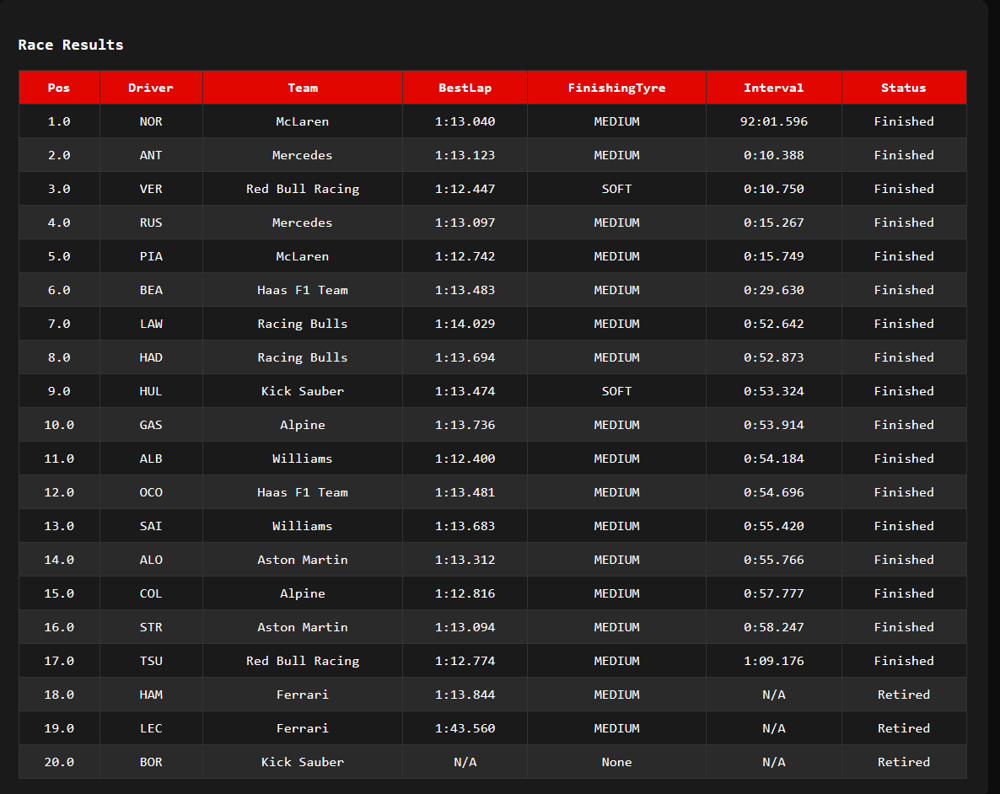
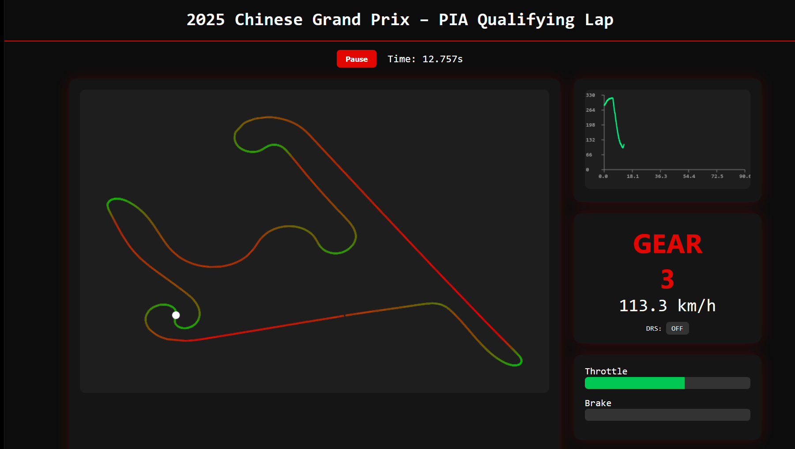

# F1 Dashboard

I’ve built this F1 Dashboard to explore and visualize Formula 1 data in an interactive, hands-on way. The goal was to create a tool where race results, driver performance, and telemetry data come alive — all in one dashboard. It’s built using FastF1, Flask, and Plotly, combining live session data with predictive insights to understand races beyond just the final results.

This project started as a way for me to practice real-world data analysis, visualization, and web development, but it has grown into a full-fledged dashboard that can display race weekends, qualifying sessions, and telemetry-based car tracking. The repository isn't open for everyone to use yet, as I still have to tweak some things. So just look around and if you have any questions you can always ask me.

## Current Features

Visualize race results and qualifying outcomes

Interactive telemetry plots for driver performance

Lap-by-lap race charts

FastF1 integration for session data extraction

Simple Flask-based web interface with templates and static visuals

## Coming Soon / Planned Features

AI-driven race predictions based on driver and team factors

AI-driven data analysis

Real-time car tracking animations for live sessions

Heatmaps and advanced telemetry comparisons

Interactive dashboards for season-wide performance analysis

Integration with additional motorsport datasets for deeper insights

Here are some screenshots of how it looks right now:

The dashboard is modular, with clear separation between data extraction, analysis, and visualization. Even though some scripts are still in development, the current setup lets you explore sample data safely and see how telemetry and race analytics can be visualized effectively.

This project has been a great way to combine my interest in motorsport, data analysis, and software development. It’s a personal showcase of what I’ve built so far and what I’m planning to add in the future — giving a clear view of both the current capabilities and the vision for the dashboard. I will be making it open source as soon as I have completed the AI portions of the dashboard. 
